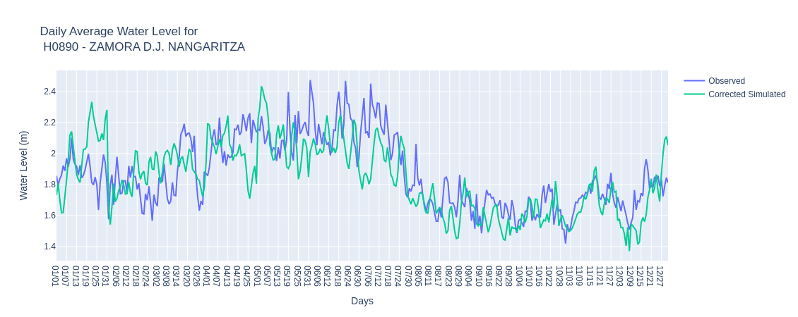

.. _Tethys-logos:

.. |logo1| image:: _static/imgs/Tethys/nwlf.png
    :width: 50

MANUAL DE USUARIOS DE LA APLICACIÓN NATIONAL WATER LEVEL FORECAST
############################################################

Este website contiene una guía para el manejo de la aplicación National Water Level Forecast |logo1|, alojada en la  plataforma
tethys de INAMHI.
Tethys fue probada mediante la implementación de portales web para socios de la iniciativa de sostenibilidad del agua del
Grupo de Observaciones de la Tierra (GEO) y de la Universidad Brigham Young University (BYU).
En Ecuador, la implementación y personalización de la aplicación ha sido posible con la colaboración del
INAMHI, Fundación EcoCiencia y el Centro Internacional de Agricultura Tropical (CIAT), mediante el programa SERVIR-Amazonia.

NATIONAL WATER LEVEL FORECAST (NWLF)
######################################

.. note:: **Información General**
             El National Water Level Forecast permite visualizar pronósticos de nivel solo donde existen datos histórico usando corrección de sesgo.

                       .. image:: _static/imgs/nwlf/initialviwenwlf.png
                          :width: 500
                          :align: center

**En esta aplicación se puede visualizar pronóstico de nivel con un horizonte de 15 días y adicional se muestra la
corrección de sesgo.**

Para cada estación, el usuario puede ver series de tiempo y calcular métricas de error. La interfaz de usuario muestra
la delimitación de los ríos en azul y de las estaciones con mediciones de nivel observadas y corregidas por le método
de corrección de sesgo identificados con puntos en rojo.

A la izquierda de la pantalla se muestra un panel |botones_desplegables| con algunas opciones de visualización:

**Provincias**

A manera de ejemplo, puede hacer clic en el botón **Zoom a la Provincia** y seleccionar Ecuador:

Pero, también puede hacer búsqueda por la provincia de interés en este caso la Provincia de Morona Santiago:

Como se observa en la imagen, se pueden observar con puntos rojos todas las estaciones localizadas en la Provincia de
Morona Santiago.

**Demarcaciones hidrológicas**

Como ejemplo, selecciones la demarcación Esmeraldas:

Como se observa en la imagen, se pueden observar con puntos rojos todas las estaciones localizadas en la demarcación
Esmeraldas.

**Unidades hidrográficas Nivel 3**

Por ejemplo, selecciones la unidad hidrográfica de la Cuenca del Río Carchi:

Como se observa en la imagen, se pueden observar con puntos rojos todas las estaciones localizadas en la Cuenca del Río
Carchi.

También en el botón desplegable, en la opción *Búsqueda por estación* localizado a la izquierda de la pantalla
puede realizar la búsqueda por estación, comid (identificación del río por código), y río.
En el siguiente ejemplo, ingresaremos al botón el nombre *río Zamora* y se marcarán en círculos negros todas las estaciones
localizadas a lo largo del río:

La búsqueda de estación se puede realizar por el código de la misma o nombre de la estación:

Una vez identificada la estación de interés al hacer clic en la misma, aparecerá una ventana emergente con los datos de
la misma.

La ventana emergente, mostrarán 4 pestañas diferentes: hidrograma, análisis visual, reporte de métricas y pronóstico.

Hidrograma
================

La pestaña muestra el hidrograma con los valores observados de nivel,y la simulación histórica corregida.
Este gráfico muestra la mejora entre el hidrograma de datos observados (azul) y el hidrograma de datos con
corrección de sesgo (verde).

El usuario puede activar y desactivar cada una de las opciones del hidrograma.

*Desactivando la capa de datos corregidos, observará los datos observados:

*Desactivando la capa de datos observadoros, visualizará los datos corregidos:

Análisis visual
=====================

La segunda pestaña en la ventana emergente es el análisis visual:
**Promedio diario**

**Promedio mensual**

**Diagrama de dispersión**

**Diagrama de dispersión usando escala logarítmica**

*De igual manera que los gráficos anteriores, es posible activar y desactivar capas en los gráficos.

Informe de métricas
======================
La tercera pestaña en la ventana emergente es el informe de métricas.

El informe de métricas tiene una lista de métricas predeterminadas, pero los usuarios pueden agregar métricas adicionales de las disponibles en el paquete
HydroStats.

Pronóstico
===============

La pestaña muestra el pronóstico corregido por sesgo con umbrales de períodos de retorno calculados a partir de la
simulación histórica corregida por sesgo. El gráfico de pronóstico proviene de 51 simulaciones diferentes más un
miembro de alta resolución, muestran los percentiles de caudal 25 y 75, caudales máximo y mínimo y un pronóstico de alta
resolución.

La leyenda desplegada en la derecha muestra las diferentes capas se pueden activar y desactivar de los
periodos de retorno calculados para la simulación histórica y la simulación histórica corregida por sesgo.
Los datos de cada período de tiempo aparecen al pasar el cursor sobre el gráfico. Los datos pueden ser descargados
desde la pestaña final.
También puede seleccionar el pronóstico de una fecha pasada al hacer clic en el calendario y seleccionar la fecha de
interés:

.. note:: **Páginas de Interés**

            Página de INAMHI: `INAMHI <https://www.inamhi.gob.ec/>`_

            Página de SERVIR-Amazonia: `SERVIR-Amazonia <https://servir.ciat.cgiar.org/?lang=es>`_

            Página de Fundación EcoCiencia: `Fundacion EcoCiencia <https://ecociencia.org/>`_

            Página de Laboratorio de Hydroinformática Brigham Young University: `Video BYU <https://hydroinformatics.byu.edu/>`_

            Video de Brigham Young University-GEOGloWS: `Video BYU <https://youtu.be/PLG8U8AQmXY>`_
